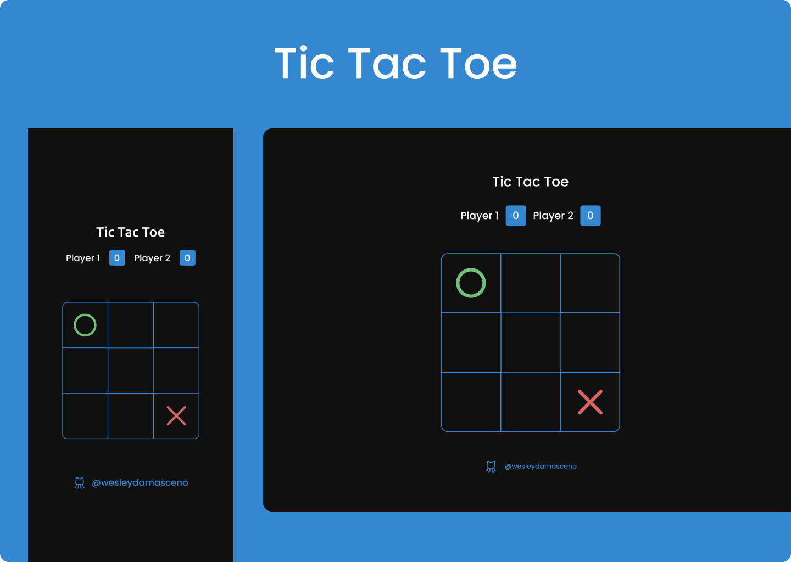

# Tic Tac Toe 🎯

This project is part of one of the challenges of the [Fullstack JavaScript](https://www.theodinproject.com/paths/full-stack-javascript) track by [The Odin Project](https://www.theodinproject.com/).  
Objective is to create a tic-tac-toe game using JavaScript Factory Functions.

  

<h2>Techs</h2>

It was used to build this application:

- Figma
- HTML/CSS
- JavaScript

<h2>Layout in Figma</h2>

The layout was developed by me using the Figma tool. You can check with this link [here](https://www.figma.com/file/6ch8dp8zP1lpAQqmwzIKlo/The-Odin-Project?node-id=34%3A2)

<h2>License</h2>

Licensed under the <a href="./LICENSE">MIT</a> license.
